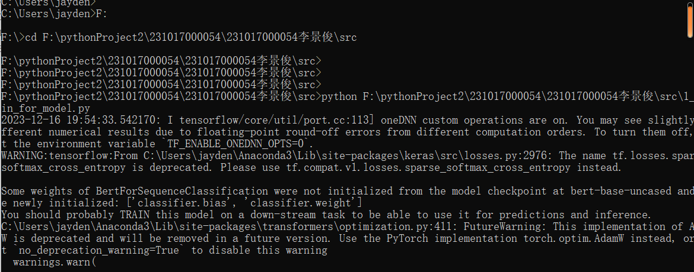
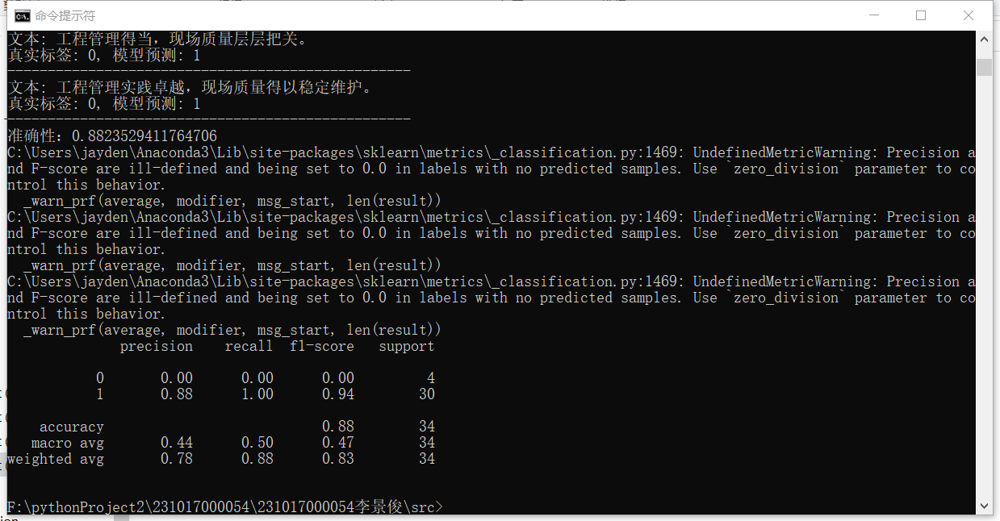

# tm23projects - 检查是正面评价还是负面评价

李景俊 231017000054

# 业务目标

往往很多语言描述是正面还是反面的意思，不同的角度理解的意思不一样，目前从工程建设场景出发，通过输入大量的工程建设描述语言，进行训练为模型，然后通过学习，通过模型来判断其评价是差评还是好评。

# 处理流程：

``` 准备数据集
    提取原始描述语言，进行句子拆分
    通过正则表达式进行初步识别，简化人工标注工作量
    导出标注结果，转换为模型输入格式
  模型定义：使用开源框架Bert
  模型训练与调参
  测试
```
  ## training如图所示：
  ## 


  ## Model如图所示：
  ## 
  ## 导出的jsonl转换为模型输入的`BIO格式`

  ## 模型test结果(bert)
  ## 

  ## 模型运行结果(bert)
  ## 

```

从模型的运行结果来看， 训练了240多条语句，人工也标注了240条语句。 通过测试模型的例子， 准确率可以达到 88.2%
最后通过模型的应用，通过随机输入一条语句，然后调用该模型进行推理， 输出“好评” 还是 “差评”。 
详情请查看模型运行结果

```